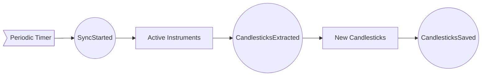

```
- `[Rectangle]` - data/records
- `((Circle))` - events
- `>Asymmetric]` - external trigger
```

# Market Data Synchronization



Events: `SyncStarted`, `CandlestickExtracted`, `CandlestickSaved`
Data records: `Active Instruments`, `New Candlesticks`
